---
# below is required for intellisense of citations to work
bibliography: [biblio.bib]
---

\pagebreak
\tableofcontents
\pagebreak

# Introduction {#sec:introduction}

Climate change is one of the most pressing issues globally, and demands action today. Organisations increasingly focus on sustainable initiatives, which contribute to transforming societies towards sustainability [@bradbury1999].

Chainge is an organisation contributing to this transformation. Chainge was established in 2019 by Paul Blakemore and Torben Damgaard Nielsen who promote sustainable goods transportation. The ambition for Chainge is to reduce the number of diesel vans transporting goods in Copenhagen by offering a sustainable alternative that reduces particle pollution and CO~2~ emissions. Chainge does this by utilising electric cargo bikes to deliver packages from Business-to-Business and Business-to-Consumers [@chaingeA2021].

Chainge's mission aligns with FN's Sustainability Goals, more specifically number 11 [@chaingeB2021] and number 13. Goal number 11 entails promoting sustainable cities and communities, while goal number 13 entails curbing climate chainge by reducing greenhouse gas emissions [@un2021sustainable]. Sustainability is thus deeply embedded within Chainge's business model and strategy.

## Case Description {#sec:case_description}

One of the primary concerns of Chainge is to increase their drop-off rate for the new bike drivers. Every minute during delivery has an impact on the profitability of Chainge's business model and cost for its customers. In this regard, it is vital that new drivers are onboarded as efficiently as possible. The overall goal of this project is therefore to optimise the drop-off rate of deliveries by focusing on optimising the onboarding process.

The scope of the project is to improve the onboarding process for new *Drivers*, as the bike drivers are called. The current onboarding process was presented by the Founder and CEO of the company, Torben, and was described as an unstructured process that could be improved. Nonetheless, the flow of the process and the sequence of actions seemed to be working well. Therefore, our focus is not to redesign the entire process but to explore what and how information should be delivered to the new employees at the beginning of their employment.

Furthermore, we decided on this problem area because we identified an opportunity for combining our competencies to accomodate Chainge's need for increase the drop-off rate in combination with onboarding new Drivers. 

## Research Statement {#sec:research_statement}

To focus our reasearch at Chainge, we have formulated two research questions. Research question 1 is problem oriented while research question 2 focuses on possible solutions to problems found in research question 1.

* *Research question 1*: What challenges affect the Drivers in the onboarding process at Chainge?
* *Research question 2*: How might we improve the onboarding process to make it more efficient for the Drivers and Chainge?

# Methodology {#sec:methods}

Our process for adressing the research questions was structured using the Double Diamond model, as described by Norman, D [-@norman2013design, pp. 220-221]. In [@fig:double_diamond] we see which methods was used in a given phase. Broadly, we used observation and interviews for exploring fundamental issues. For converging on the problems experienced we used color coding to see which problems was experienced by study participants. With a focused problem, we explored several ideas in an ideation workshop using brainstorming and sketching. In a group discussion, we converged on an idea for further prototyping that was to be implented in code. We chose an idea which was 1) grounded in empirical data and 2) realistically could be implemented within project time restrictions. A high fidelity prototype was coded and tested on potential users from ITU. Each method is explained in more depth in the following sections.

<!-- Addressing the research questions required gaining insights into Chainge as an organisation and collective of workers. These insights were obtained through a qualitative assessment of the work culture and employees’ responsibilities, by conducting three interviews with newly hired (less than four weeks in their position) Drivers, and then analysing the collected data. <!-- Add more about what we did after data analysis...? -->

{#fig:double_diamond width=80%}

## Interviews {#sec:interviews}

As part of the empirical gathering, we interviewed Torben, the Founder and CEO of Chainge, to get an understanding of the business in general and the onboarding process. The interview was informal and involved an introduction to the facilities at the headquarters and the electric cargo bikes. To remember the context of the headquarters we took a series of pictures (see [@fig:chainge_headquarters]). Due to the nature of the interview, we had not created an interview guide. The interview was informative and provided a great understanding of the business and strategy. The session with Torben also had a positive impact on our collaboration due to the informal talk in between case related subjects. Nevertheless, the interview supported us in clarifying and guiding us towards the next step in the process.

::: {#fig:chainge_headquarters}
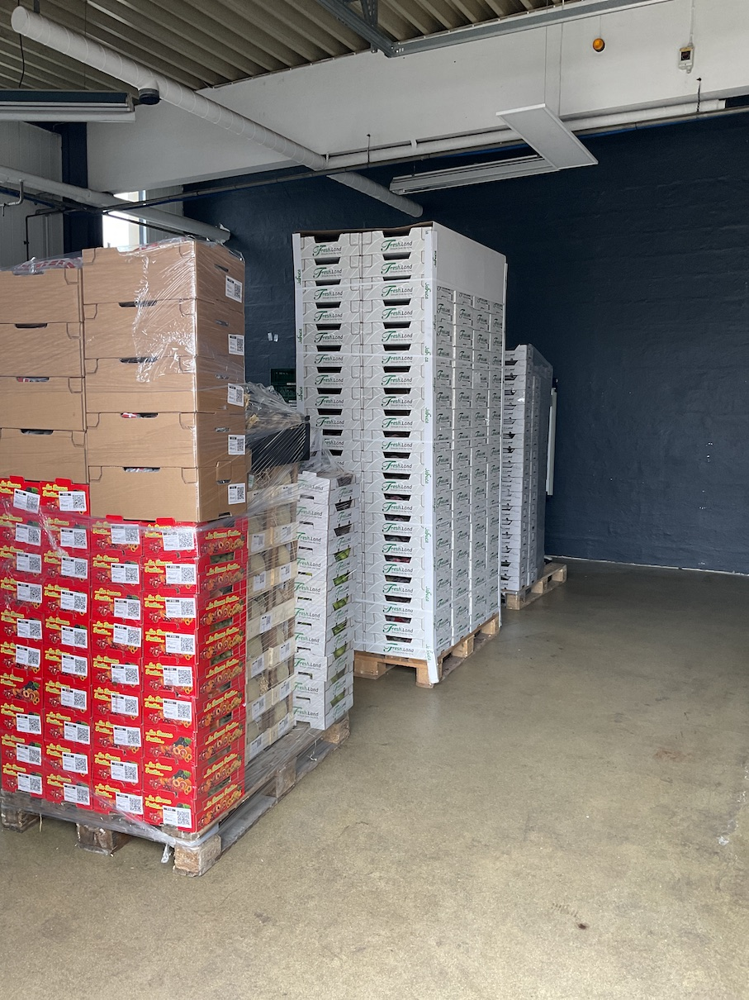{width=32%}\hfill
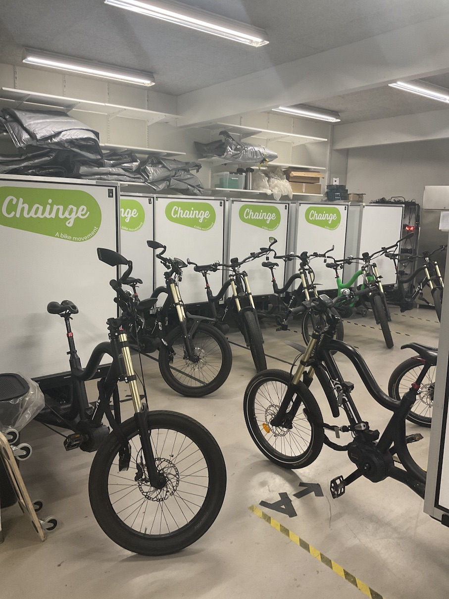{width=32%}\hfill
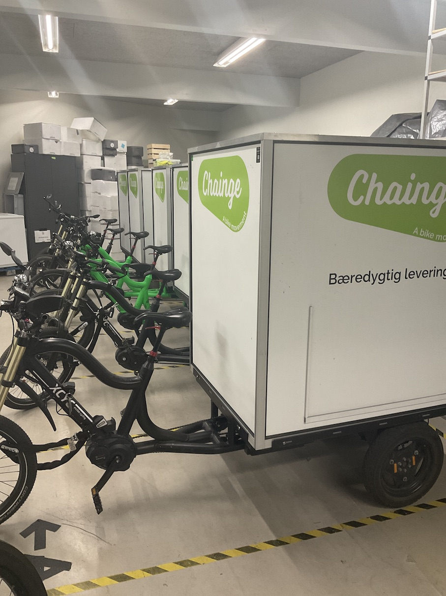{width=32%}

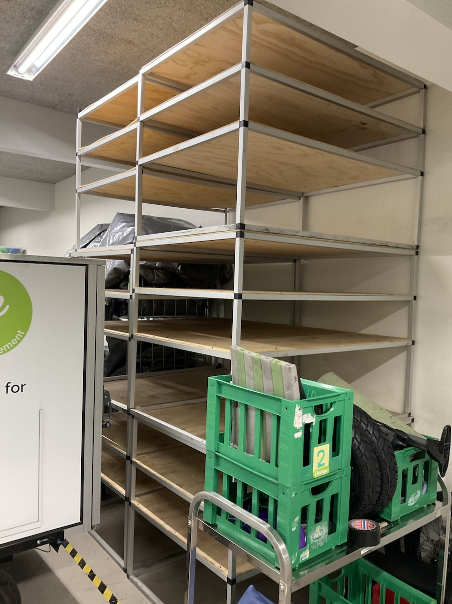{width=32%}\hfill
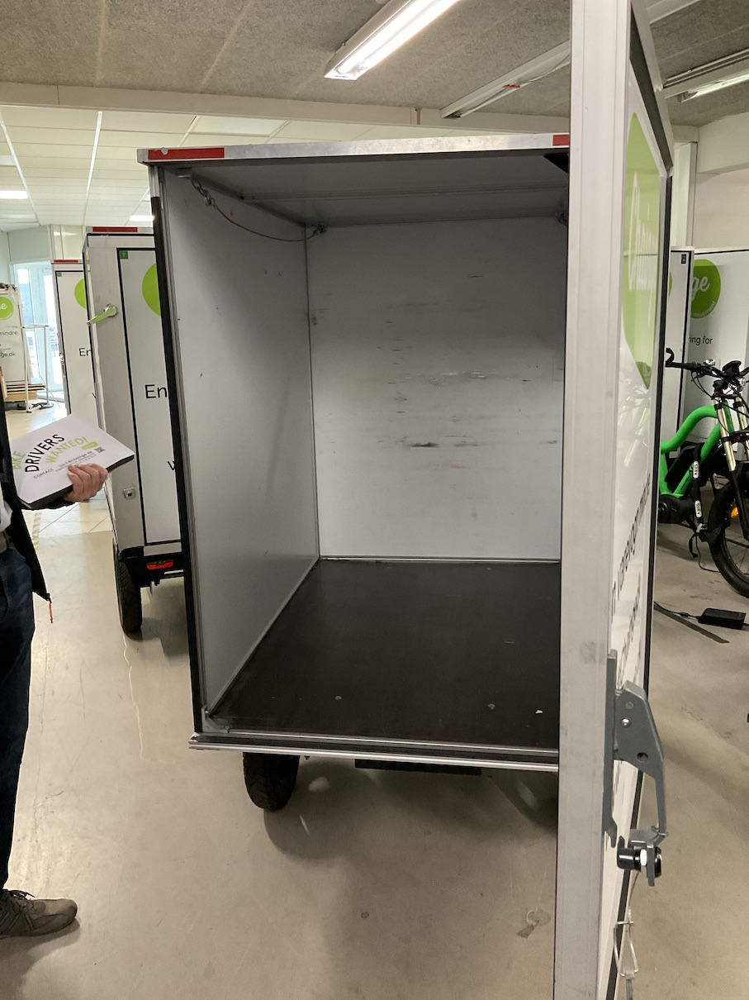{width=32%}\hfill
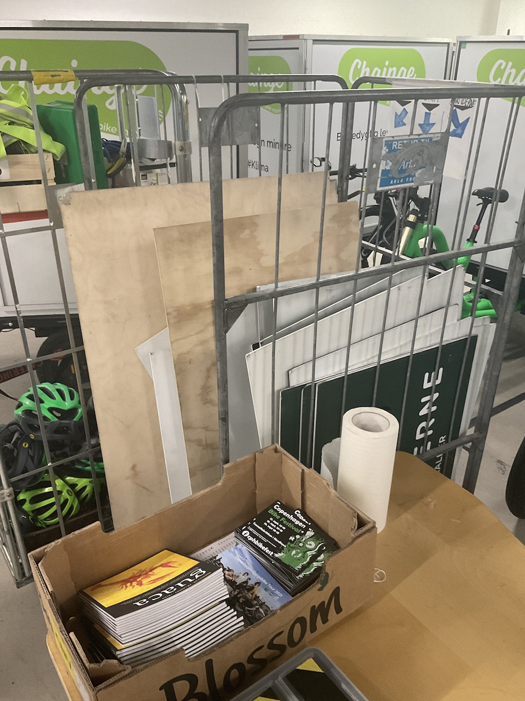{width=32%}

The Head Quarters of Chainge
:::

We wanted to interview Drivers working at Chainge to learn more about their work tasks and the onboarding process. Torben from Chainge assisted in arranging interviews with newly hired Drivers a week later. We wanted to interview Drivers that had recently experienced the onboarding process or were in the middle of the onboarding. We conducted three interviews with new Drivers that had worked at Chainge for less than four weeks. The three Drivers had worked at Chainge for one week, two weeks and three weeks respectively.

The interviews were conducted at Chainge’s headquarters to make it convenient for the interviewees. Prior to the interviews, we created an interview guide to structure and facilitate the interviews. This guide was semi-structured, which is more flexible for structured interviews but not as loosely structured as unstructured interviews [@bryman2016social]. The interview guide provided flexibility for questions that suddenly arose but at the same time managed the interview in a way so we did not deviate from the planned questions. We gained a lot of knowledge from the interviews. 

<!-- Move to findings -->
One incident during one of the interviews was particularly interesting. When the interviewee was asked about challenges related to job tasks, she referred to a situation where the recipient was not home to receive the package. Instead of bringing the package to the headquarters, she went back later on her delivery route to try and deliver the package again (Interview 3). The interviewer that conducted the interview would probably not have paid special interest in the statement if Torben had not explained the standard procedure some days in advance. The standard way of working is to only try to deliver the packages once and if nobody is at the designated location, then the package is to be brought to the headquarter. This example together with the other interviews shed light on the need for an improved and structured onboarding process focussing on communication.

## Colour coding of data {#sec:colour_coding}

Numerous frameworks and tools exist for grouping interview data in categories. We chose an accessible and visual methodological approach of highlighting words and sentences with colors, each color corresponding to a category in our coding format table [@tbl:colortable]. It illustrates the colours and the corresponding definitions.

| Colour | Definition                                     |
| ------ | ---------------------------------------------- |
| Green  | Positive aspects of the Drivers' job           |
| Yellow | General knowledge about work practices         |
| Red    | Challenges/insecurities experienced by Drivers |

: Colour Coding Table {#tbl:colortable}

<!--Remove-->
This approach is inspired by Grounded Theory, which advocates for grounding research approaches in empirical data at every step of the process [@charmaz2006constructing]. Grounded Theory advocates not only leveraging interview data as a source of knowledge, but also as a starting point for conducting further ethnographic research. This is known as deductive determination, wherein the research focus is determined by deducing the main points in the data [@charmaz2006constructing].

<!--Remove-->
The aim is to improve the onboarding by structuring relevant information for the Drivers. We decided to highlight data in relation to the different categories to prioritise information relevant for the final solution. 

The three color codings were chosen, as we would be able to clearly highly positive aspects of the onboarding process that should not changed (green code), information that might be needed in the corresponding solution (yellow code) and challenges and/or insecurities that need to be addressed in the onboarding process (red code).

## Participant observation {#sec:participant_obs}

As part of our empirical gathering, we have conducted participant observation. Spradley has categorised different degrees of participant observation. We utilised the type of participation classified as passive participation. ~~Spradley applies the insider/outsider perspective to explain the degree of participation~~ [@spradley1980observation].

The person being observed was one of the interview respondents that was also a newly hired Driver. This observation was arranged during our interview with the Driver. The Driver agreed to being observed while driving a delivery route for Chainge. The Driver was followed on bike by two of the students from the group and was observed while performing his work tasks. ~~The students did not seek to maintain a balance between an insider/outsider perspective as they merely behaved as outsiders to observe from the outside~~. The students drove after the Driver so they were present at the scene but they did not participate in performing the work tasks. We decided to pursue participant observation with the aim of exploring tacit knowledge about the work tasks that was not vocalised during the interview.

Additionally, we wanted to take pictures and videos as they could be useful later on and as a point of reference for the remaining students that did not participate.

::: {#fig:chainge_driver}
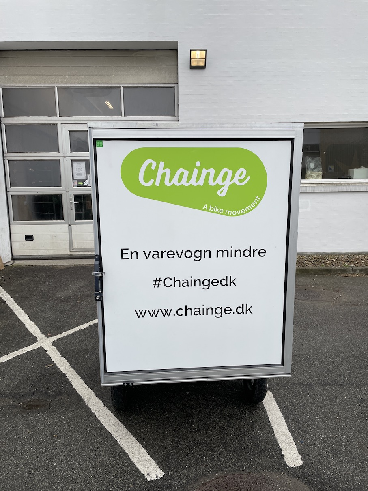{width=49%}\hfill
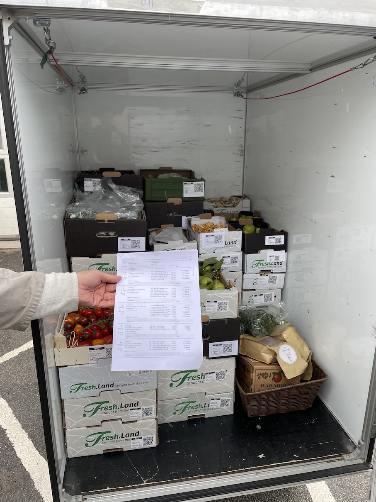{width=49%}

Pictures showing the trailer and checklist used by Drivers.
:::

We experienced an interesting situation before we jumped on our bikes to tag along the Driver. At the headquarter, we observed a manager conveying a large amount of information to a small group of new Drivers on how to deliver packages to customers.

## Ideation Workshop {#sec:ideation_workshop}

Grounded in the themes identified through our category-coded interview data, we conducted an internal ideation workshop with brainstorming as the main focus, wherein we explored the design openings and potential solutions. Our approach was to ignore the technological possibilities in situ, as well as any constraints, leveraging a user-centric approach instead. In this process we emphasised the benefits a solution would have on Chainge employees, with basis in the problems they vocalised in our interviews <!--insert reference-->.

Kolko describes how brainstorming emerged as a playful and creative way of problem solving. Four principles are relevant in a brainstorming session: to avoid criticisms, encourage crazy ideas, produce a variety of ideas and utilise the ideas from the team members to build upon to extend ideas [@kolko2018designthinking]. According to Kolko, empathy is the foundation of participatory design practice.

We brainstormed themes on a whiteboard to figure out what should characterise the solution. Afterwards, we individually marked three words each that we found the most important. It became evident through this process that the central theme of our solution should be the existence and contextual accessibility of structured, standardised information on work practices and responsibilities for Chainge drivers. We have strived to be empathic in the brainstorming within the group to be open-minded and explorative when being presented to ideas.

::: {#fig:brainstorm}
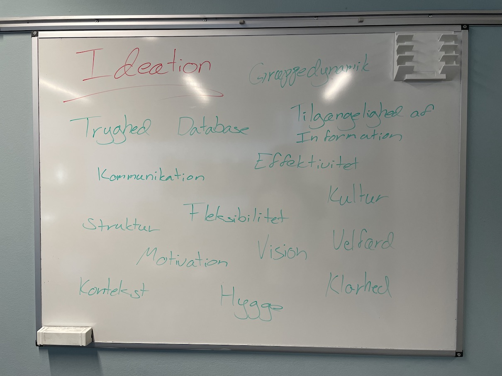{width=32%}\hfill
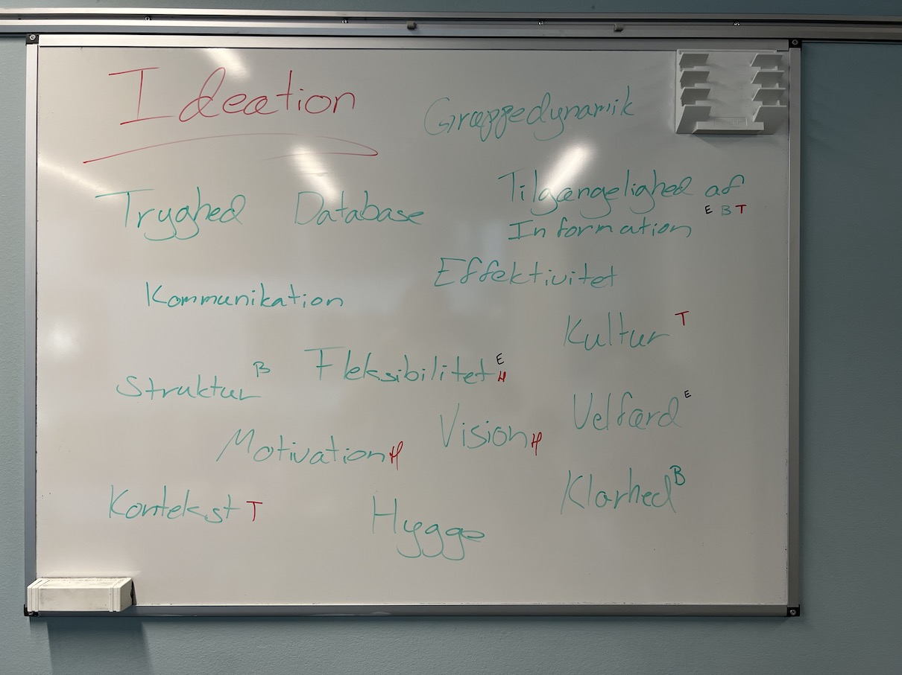{width=32%}\hfill
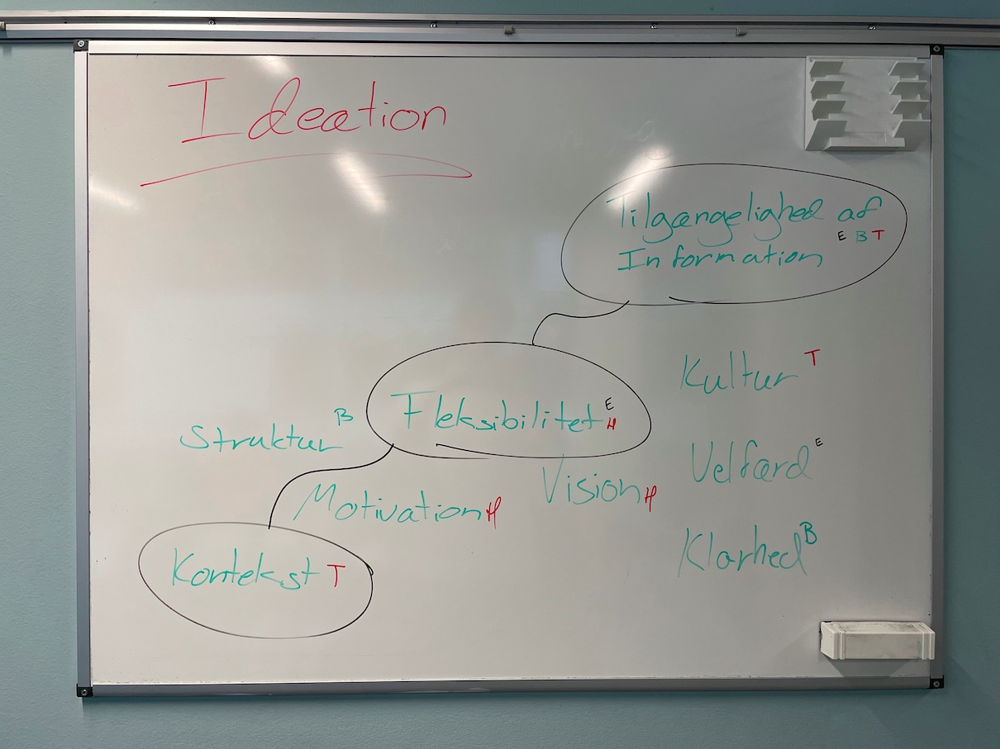{width=32%}

Subfigures caption
:::

Sketches... <!-- insert reference on sketching (THOR) -->

::: {#fig:sketching}
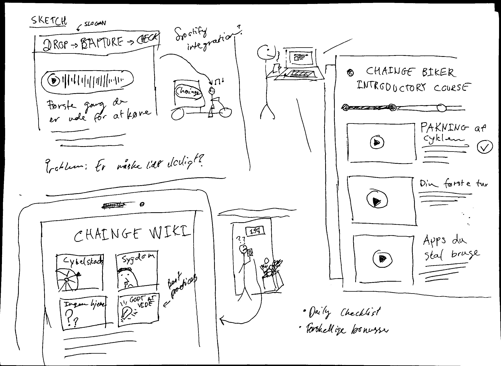{width=49%}\hfill
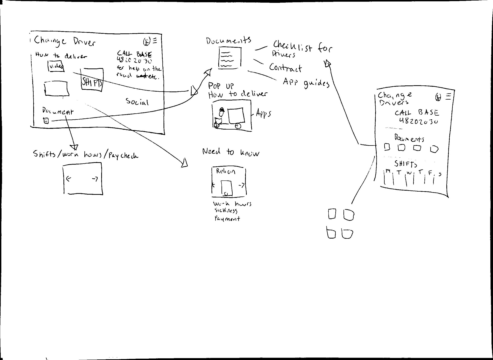{width=49%}\hfill
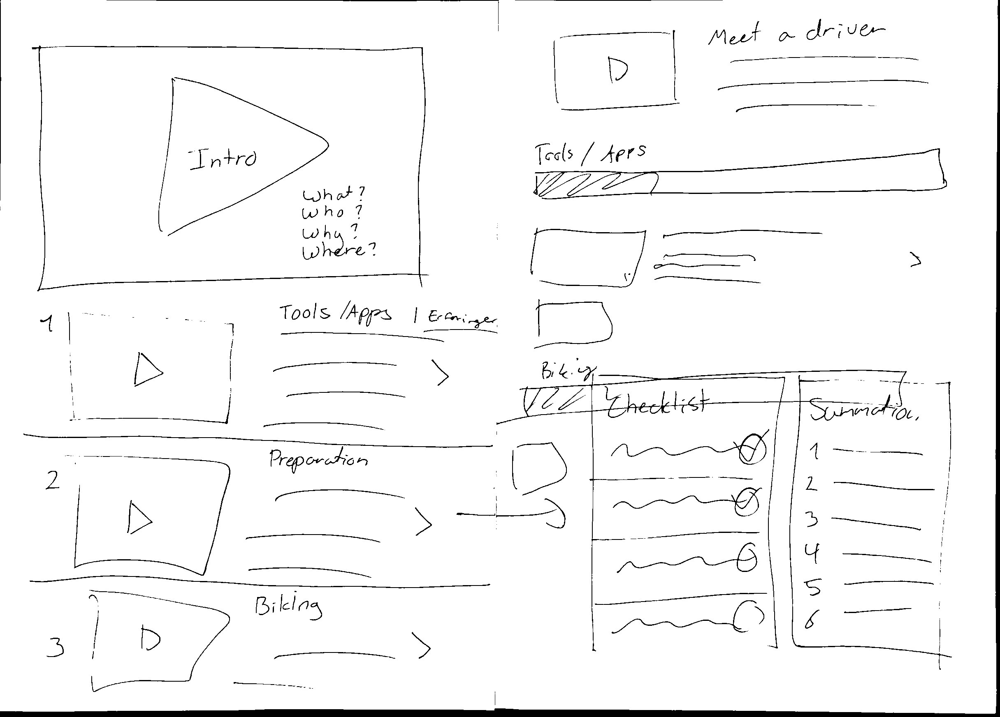{width=49%}\hfill
{width=49%}

Subfigures caption
:::

## Prototyping {#sec:prototyping}

Our prototyping process began with a discussion of which elements of the design should be emphasized or de-emphasized. Because our prototype was a small component in the larger context of a platform, the operational medium had to be perceivable as one component of many collective components. We understood this process as experimental development based on our ideation, ~~for the purpose of affirming or denying preconceived notions~~.

Bucheanau and Suri raise the notion that a prototype is any medium produced to communicate or explore ideas [@buchenau2000prototyping]. Our goal was to not only communicate amongst ourselves a representation of our collective ideas, but to also communicate to and explore it with potential end-users.

Stotlerman et al. argue that prototypes manifest in three dimensions: medium, resolution, and scope. Our prototype reflects these dimensions by being consciously shaped as a digital platform, with a high degree of fidelity, and a scope fixed to the learning component. We chose to build a high-fidelity prototype based on our low-fidelity sketches, because we were less interested in co-designing with users, and more interested in presenting a highly-structured and accessible platform [@lim2008anatomy].

{#fig:mockup width=75%}

## Evaluation {#sec:evaluation}

We decided to test the prototype with a individual that do not work at Chainge. A technical description of the prototype is outlined in [@sec:technical_impl]. The target group of the prototype is new Drivers, therefore we did not find it relevant to test it on existing employees as they are potentially biased from their experience working at Chainge. We tested the platform on a individual studying at ITU. The test was mostly concerned with a proof of concept and to identify potential pain points. We wanted to explore if the prototype was easy to navigate. Additionally, we wanted to show the video on the platform to get information regarding if it showcases the different work tasks that a Driver can be presented with.

<!-- Insert something about testing criteria? -->

# Findings (EMIL) {#sec:findings}

Potential Chainge Drivers apply for the job on Chainge’s website where they fill out a formula with their contact information. It is not required to submit a resume or motivational letter to the application (Interview 3). The current onboarding process begins with Paul reaching out to applicants. Paul invites a small group of applicants to visit Chainge and get an introduction to the job tasks. The interview session takes around one hour and the applicants are introduced to the facilities at the headquarter. The applicants try to ride an electric cargo bike to see if they feel comfortable driving it. One of the interviewees described the environment during the session as a safe space as there was no pressure to get on the bike and she experienced a focus on safety first (Interview 3). The applicants try driving the bike both with and without the battery to experience the speed (Interview 3).
If the applicants are interested in the job, then a test run is scheduled a few days later to simulate a typical work day. Afterwards, the applicants either accept or reject the job proposal (Interview with Torben).

If the applicants accept, they are given login credentials to various apps to use when completing work tasks. One of the apps is called Relion and is used to enter work hours and check planned shifts ahead in time. There exist different apps to use when delivering packages for the clients as they all have their individual systems that require a specific app.

<!--
* Define onboarding process
* Add description of roles
* Drivers receive information in a very just-in-time and unstructured manner
* Existing employees spend time on educating new drivers
* Young Drivers
-->

## User Testing {#sec:user_testing}

The testers confirmed that the high fidelity prototype was easy to use. We wanted to test if the tester understood the Driver’s potential work tasks by viewing the video that we have created. The video is the first encounter when using the platform. The results of the user testing can be seen in appendix <!--Insert appendix-->.

# Solution {#sec:solution}

Due to the scope of the project, the proposed solution is designed for internal use only as the users are employed at Chainge. The users of the solution are the new Drivers, existing Drivers and the management of Chainge. Based on insights from our empirical gathering, **we found that some of the Drivers do not speak Danish, therefore we decided to create the solution in English**. Functionality to change the language could be added later on to accommodate multiple languages but it was not prioritised in the prototype.

We have named the solution "Trainge" and it consists of a variety of elements but due to the lenght of the course, we have decided to focus on the . The developed prototype focuses on an element within the Trainge platform. The element entails videos to educate new Drivers about work tasks and tools. When visualising the element, we all had a similar idea about the design and subconsciously we were inspired by the Apple Developer app. The inspiration was not intended but it does not surprise us that we intuitively lean towards the Apple Developer app, as it is a well known platform for developers.

::: {#fig:developer}
{width=24%}\hfill
{width=24%}\hfill
{width=24%}\hfill
{width=24%}

Subfigures caption
:::

As stated, the proposed video element is part of a platform that is accessed with login credentials to personalise the content and to ensure data security. The idea behind this platform is to create a space for each individual Driver to obtain and store knowledge relevant to their job. The proposed solution is designed to assist the Drivers whenever they need support. For instance, the platform could be useful to utilise when in doubt of which app to use when delivering packages for a specific client or how to use internal apps. In this case, the Driver could watch a video describing in detail what action is needed. One of the interviewees described that he did not receive an introduction to how to use one of the apps so he needed to figure it out by himself (Interview 1). It could be an ideal use case for utilising the proposed solution to watch a video about the app.

The videos are intended to be informative and function as guidance when needed. We imagine that the videos are especially valuable in the beginning of employment when there is a lot of new information and much to remember.

<!-- "Through testing we determined that before learning about resources, users would like a brief/overview of which resources are available to them." -->

## Organizational Context {#sec:organisational_context}

The proposed solution would also be valuable for the management of Chainge. The platform is digitising and standardising work routines, consequentially optimising the use of resources spent on onboarding new drivers. During participatory observation at the headquarters, we observed a manager at Chainge explaining to three new Drivers how to pack a cargo bike for a certain client [@fig:chainge_driver] <!--(insert appendix + image) -->. The manager was also responsible for picking up the phone if the Drivers were out delivering packages and needed assistance with situations related to delivering. The manager’s phone rang while he explained the process to the new Drivers. The resources could be spent differently and the walk-through could be replaced by a video outlining the process.

The proposed solution could be a valuable asset for Chainge in allocating responsibilities more efficiently which could have great impact on the business.

The proposed solution does also entail an element for storage of documents. The documents should be relevant for the individual employee, for instance, a work contract and paychecks. The Driver that we interviewed did not have any knowledge regarding where they could find their paycheck and one of the interviewees had not received a contract yet (Interview 1, Interview 2, Interview 3). The described storage element could be the primary location to place such documents which would ideally create alignment and eliminate confusion.

## Technical Implementation of the Prototype {#sec:technical_impl} <!-- INSERT REFERENCES -->

The Trainge prototype is built as a web application written in a functional style using F#, as F# offers many language features that prevent program errors compared to other languages such as Javascript or Typescript. Using the Fable F# to Javascript compiler, the prototype is then able to be run as a web application in the browser. The F# code robustness is transitively applied to the resulting compiled Javascript when using Fable.

Several large frameworks are used to realise the prototype, mainly the React and Bulma frameworks which are used to define the structure, look and reactivity of the prototype. Reactivity is important, as it allows the UI to become driven by data instead of imperatively/manually updating relevant UI components when the underlying data changes. This is automatically afforded to us using React. As React is not a native framework to the F# language, an auxiliary library called Feliz is used to interface between F# and the Javascript-based React framework.

The code is structured using the Elm Architecture (TEA). TEA is a way to split an application into smaller applications or components that are easily composed together without introducing unnecessary coupling between said components. Essentially, it is a way to control 'spaghetti' code <!-- reference? --> and make sure that error inducing changes in one part of the prototype does affect another part of the prototype. This is strictly not necessary for a small prototype as Trainge, but hugely useful in the case Chainge needs to scale up the prototype to a fully fledged application.

# Discussion {#sec:discussion}

# Reflexivity {#sec:reflexivity}

<!-- Should be one page-->

* Not an iterative approach because the solution is not tested on users/non-users (Emma)
* Used double diamond model as 1) we needed to create prototye and 2) we needed a common language to understand where we were in the process and where we were headed.
* Why did we do what we do

We planned the phases of our inquiry into the problem area, and the development of our solution, and used the model as a guiding reference point throughout the process. As our approach was neither agile nor iterative, the final documented process ended up fitting well onto the Double Diamond model, as we diverged into the problem area, converged on a specific problem, diverged into the solutions, and converged on developing a prototype, [@fig:double_diamond].

# Conclusion {#sec:conclusion}

\newpage

# Bibliography {#sec:bibliography}

\addvspace{0.5cm}

::: {#refs}
:::

\newpage

# Appendices {#sec:appendices}

* Appendix ???: User testing